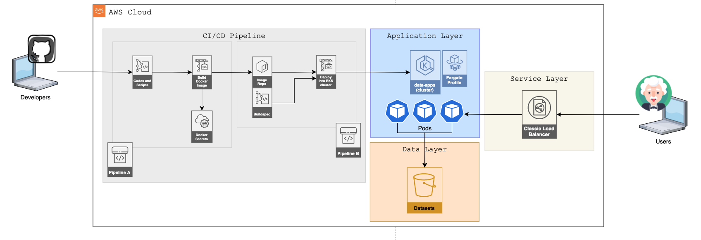
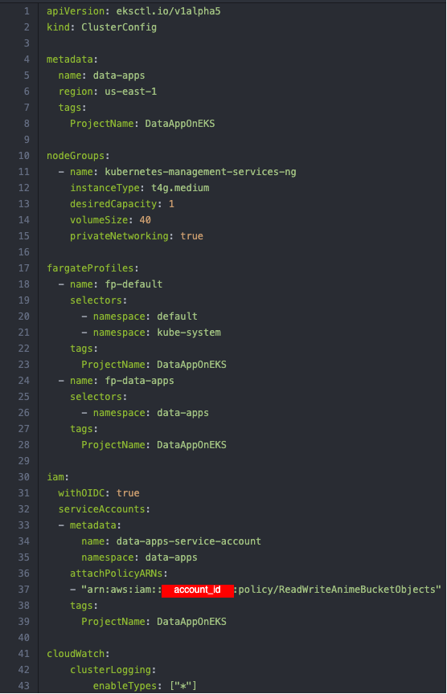
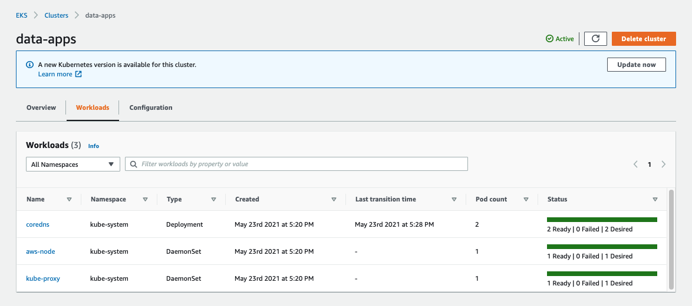

# data-app-on-eks

## About me

This project is a suggestion about how it's possible to build and delivery data apps quickly, by using technologies such as:
-  Python
-  AWS Data Wrangler
-  Streamlit
-  Amazon Elastic Kubernetes Service
-  AWS DevOps stack

In order to accelerate the delivery of the apps, we offer a model of a CI/CD pipeline using many modern and reliable tools from AWS. Responding to every change of the code, building new versions of Docker images and finally deploying into the Kubernetes cluster.

## Dataset

The dataset used in this project were processed using the project [myanimelist-data-collector](https://github.com/lmassaoy/myanimelist-data-collector). A web scrap project capable to download data of thousands of titles of anime. Transforming the data from json to parquet, in order to offer the best performance on analytics tasks.

## The App

The application built in Python using [AWS Data Wrangler](https://aws-data-wrangler.readthedocs.io/en/stable/) and [Streamlit](https://streamlit.io/) is a sample about how easy and fast you can build applications to navigate your users/customers through **Data Visualization**, **Data Analysis**, and **ML/IA solutions**.

It doesn't require expertise with front-end techologies, thanks to Streamlit resources you can build the back-end and the front-end only using the framework.

If you liked what you've read so far, please check the [Streamlit page](https://streamlit.io/) to know more about this amazing solution.

## Amazon EKS cluster

To run our applications we'll need a Kubernetes cluster. [Amazon Elastic Kubernetes Service (Amazon EKS)](https://aws.amazon.com/eks/) accelerates the way we build and manage a cluster Kubernetes, and [eksctl - The official CLI for Amazon EKS](https://eksctl.io/) helps us to build the cluster and its resources, by using simple commands and config files.

### eksctl script

### cluster created using the config file

## CI/CD Pipeline

The pipeline is composed of 4 AWS tools:

|Service Name|Purpose|
|-|-|
|[AWS CodeCommit](https://aws.amazon.com/codecommit/)|our repository of code|
|[AWS CodeBuild](https://aws.amazon.com/codebuild/) |our tool to build docker images and deployment|
|[AWS CodePipeline](https://aws.amazon.com/codepipeline/)|wrapping the previous two tools|
|[Amazon ECR](https://aws.amazon.com/ecr/)|our docker images' repository|

The workflow in short can be reflected by the following steps:

- code pushed to AWS CodeCommit repository
    - AWS CodeBuild gets the updates from the branch and build a new Docker image, by reading the buildspec.yml file
        - The image is stored in Amazon ECR repository
            - AWS CodeBuild gets the new image and deploy into the EKS cluster, by reading the buildspec_deployment.yml and deployment.yaml files
                - The Pods are created in the cluster, along the Service (ELB) and Horizontal Auto Scaling

# How To

Please follow the [link](cloudformation/README.md) to understand how to proceed.