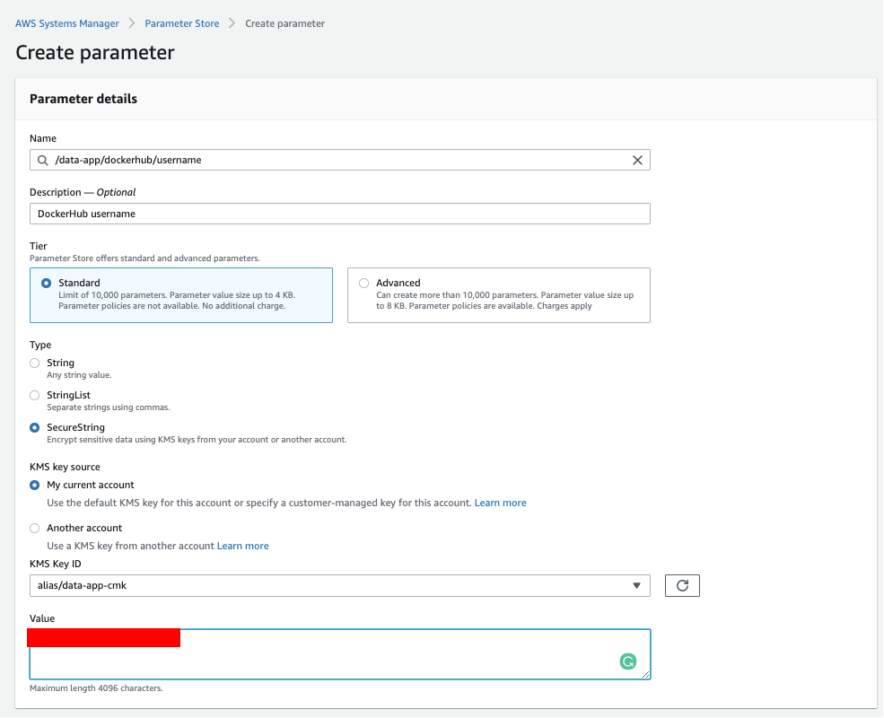
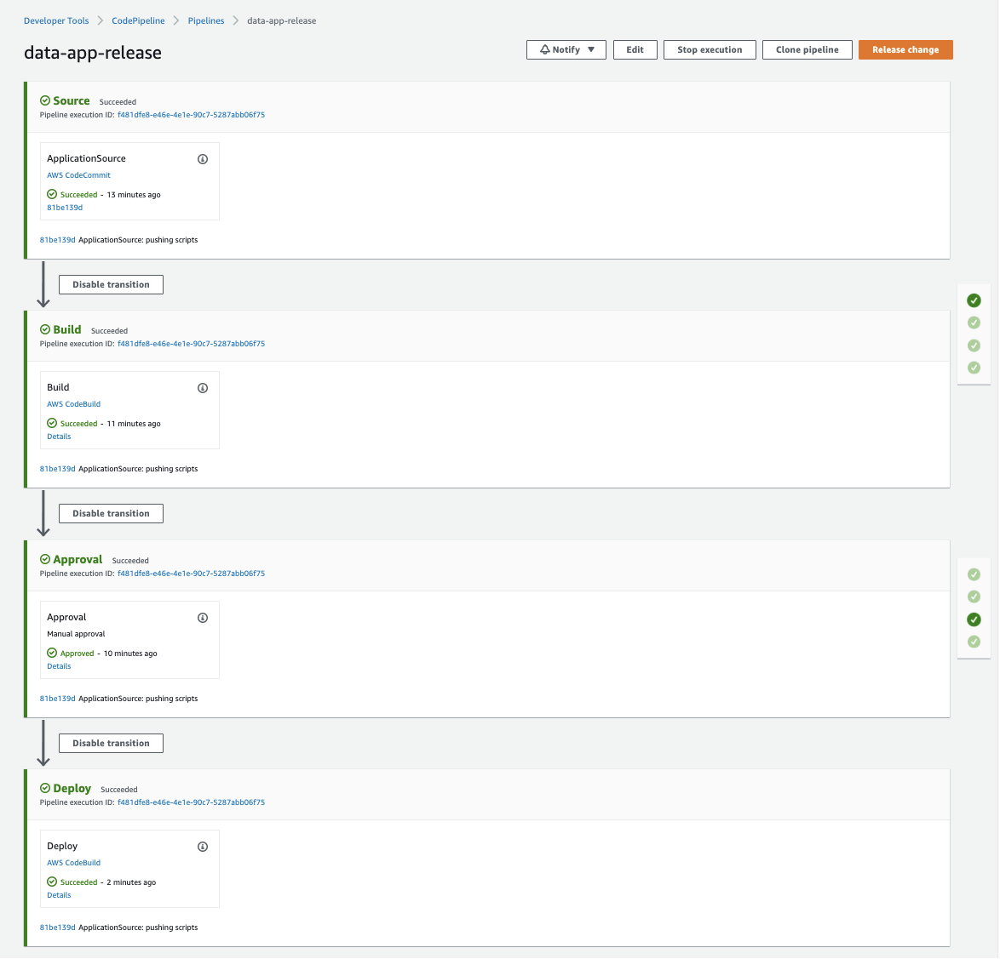
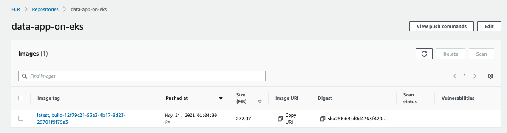
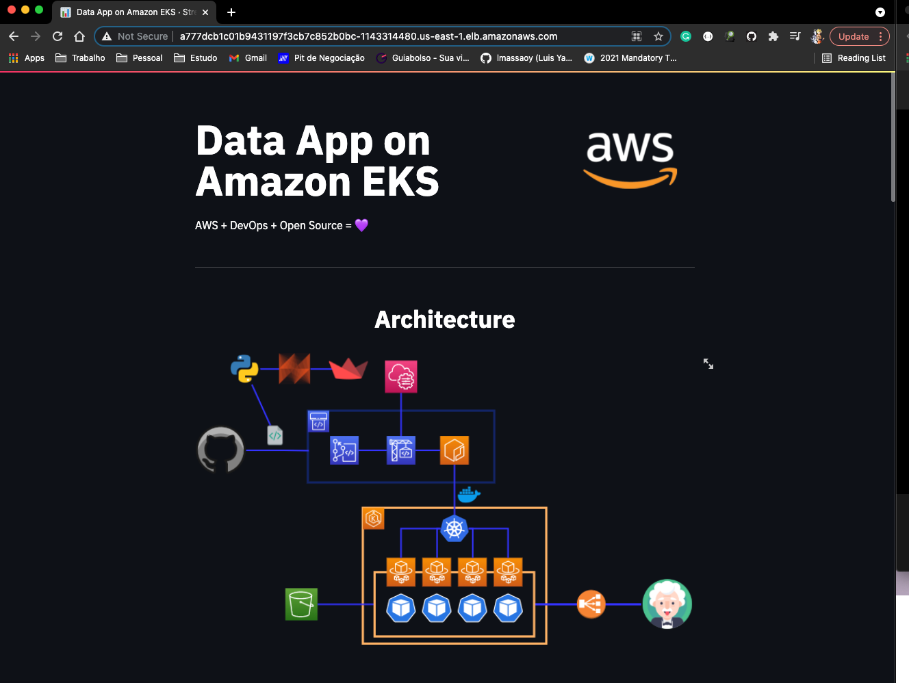

# Building the DevOps Pipeline

## Pre-Reqs
- AWS CLI already configured (version >= 2.1.6)
- export AWS_ACCOUNT=790777599382
- Docker Hub credentials


## CloudFormation - Building the Pipeline
```
$ aws cloudformation deploy \
    --template-file cloudformation/apps/devops-pipeline/devops-pipeline.yaml \
    --stack-name data-app-devops-pipeline \
    --capabilities CAPABILITY_NAMED_IAM \
    --tags ProjectName=DataAppOnEKS
```

## SSM Parameter: SecureString (not supported in AWS CloudFormation)

Please create the following parameters encrypting the parameters using the CMK created in the CloudFormation stack.

Use the DockerHub credentials inside the parameters





## Populating our CodeCommit repository

**Important**

In order to clone the repository, you should set up your GIT credentials (https://docs.aws.amazon.com/codecommit/latest/userguide/setting-up-gc.html). Make sure you already have them before proceeding.

Run the following command to clone the CodeCommit Repository into your local repo.
```
$ sh cloudformation/apps/devops-pipeline/git-clone.sh
```

Now let's copy the scripts of our Data App into the repository and push them into the AWS CodeCommit Repository.
```
$ sh cloudformation/apps/devops-pipeline/push-to-codecommit.sh
```
Because of the integration of the CodePipeline, once the push is done, the workflow will build a Docker image into your repository in Amazon ECR





## Deployment into Amazon EKS cluster

To deploy the application run the following commands:
```
$ sh cloudformation/apps/devops-pipeline/create-deployment-file.sh
$ kubectl create -f cloudformation/apps/devops-pipeline/deployment.yaml -n data-apps
```
Output:
```
deployment.apps/deployment-data-apps created
service/data-apps-on-eks created
```

Check if the service is already exposed getting the 'EXTERNAL-IP'. 
```
$ kubectl get service -n data-apps
```
Output
```
NAME               TYPE           CLUSTER-IP       EXTERNAL-IP                                                               PORT(S)        AGE
data-apps-on-eks   LoadBalancer   10.100.120.229   a777dcb1c01b9431197f3cb7c852b0bc-1143314480.us-east-1.elb.amazonaws.com   80:31641/TCP   8sus-east-1.elb.amazonaws.com   80:32174/TCP   7m54s
```

Make sure the pods are running then you can access the ELB URL exposed by EKS.

