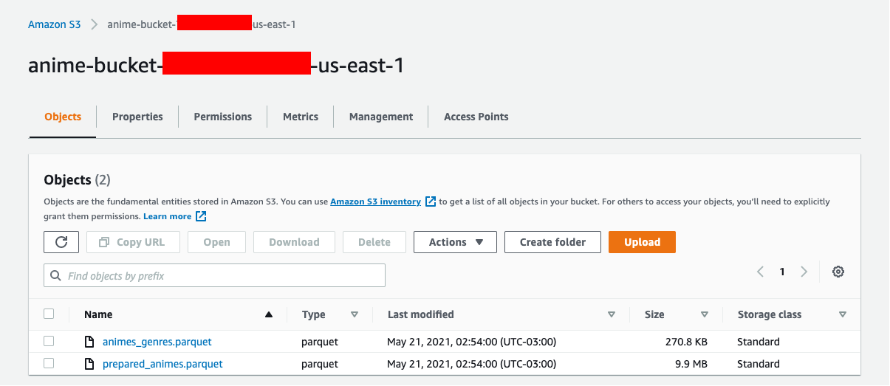

# Building the Storage for the Dataset

## Pre-reqs:

- AWS CLI already configured (version >= 2.1.6)

## CloudFormation execution to build the cloud components

Run the following command to build a stack that creates an Amazon S3 bucket to store our datasets and build artifacts:
```
$ aws cloudformation deploy \
    --template-file cloudformation/infra/dataset-storage/dataset-storage.yaml \
    --stack-name data-app-object-store \
    --capabilities CAPABILITY_NAMED_IAM \
    --tags ProjectName=DataAppOnEKS
```

## Sending the datasets to S3 bucket

Run the following commands:
```
$ export BUCKET_NAME=$(aws cloudformation --region us-east-1 describe-stacks --stack-name data-app-object-store --query "Stacks[0].Outputs[?OutputKey=='AnimeBucketName'].OutputValue" --output text)

$ aws s3 cp --recursive dataset/ s3://$BUCKET_NAME/
```

Once its done, you should see your files stored.

