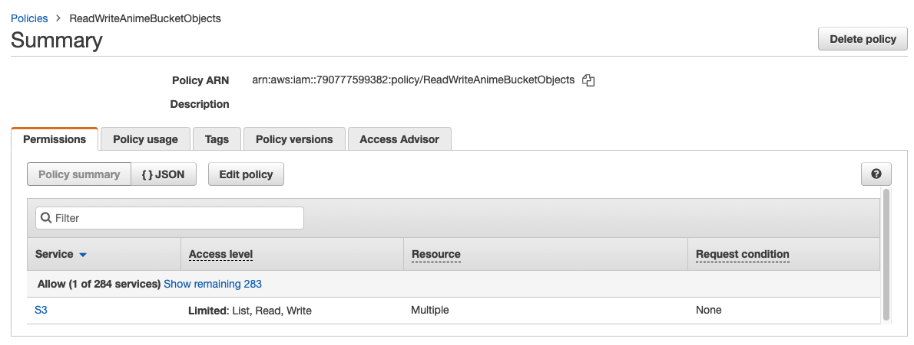
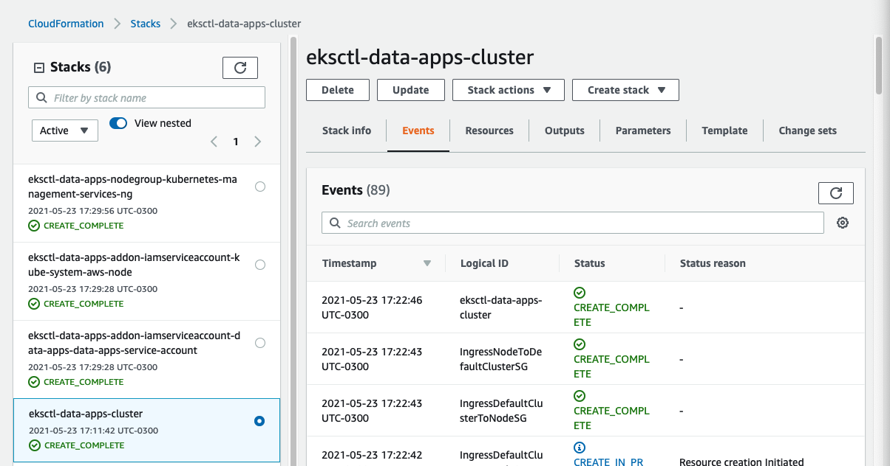

# Build your own Amazon EKS cluster

## Pre-reqs:

- eksctl (version >= 0.50.0)
    - https://eksctl.io/introduction/
- kubectl (latest)
- AWS CLI already configured (version >= 2.1.6)
- export AWS_ACCOUNT=<your_account_id>

## Step-by-Step

First you should run the following command to create some config files:
```
$ sh cloudformation/infra/eks-cluster/generate-config-files.sh
```

### Security

1. Create a policy that allows our containers to access the AWS components

    Run the following command:
    ```
    $ aws iam create-policy --policy-name ReadWriteAnimeBucketObjects --policy-document file://cloudformation/infra/eks-cluster/read-write-s3-policy-doc.json
    ```
    

### Cluster + Fargate Profile + Node Group + Service Account

1. Creating the cluster and its resources

    Running the following command creates a stack at AWS CloudFormation that builds the Amazon EKS clusters using AWS EC2 Auto-Scaling (Node Group), Fargate profiles, and an IAM role (Service Account):
    ```
    $ eksctl create cluster -f cloudformation/infra/eks-cluster/data-apps-cluster.yaml
    ```

    The output should be like this:

    ```
    2021-05-23 17:11:29 [ℹ]  eksctl version 0.50.0
    2021-05-23 17:11:29 [ℹ]  using region us-east-1
    2021-05-23 17:11:30 [ℹ]  setting availability zones to [us-east-1b us-east-1f]
    2021-05-23 17:11:30 [ℹ]  subnets for us-east-1b - public:192.168.0.0/19 private:192.168.64.0/19
    2021-05-23 17:11:30 [ℹ]  subnets for us-east-1f - public:192.168.32.0/19 private:192.168.96.0/19
    2021-05-23 17:11:31 [ℹ]  nodegroup "kubernetes-management-services-ng" will use "ami-0d3a2843104595ea9" [AmazonLinux2/1.19]
    2021-05-23 17:11:31 [ℹ]  using Kubernetes version 1.19
    2021-05-23 17:11:31 [ℹ]  creating EKS cluster "data-apps" in "us-east-1" region with Fargate profile and un-managed nodes
    2021-05-23 17:11:31 [ℹ]  1 nodegroup (kubernetes-management-services-ng) was included (based on the include/exclude rules)
    2021-05-23 17:11:31 [ℹ]  will create a CloudFormation stack for cluster itself and 1 nodegroup stack(s)
    2021-05-23 17:11:31 [ℹ]  will create a CloudFormation stack for cluster itself and 0 managed nodegroup stack(s)
    2021-05-23 17:11:31 [ℹ]  if you encounter any issues, check CloudFormation console or try 'eksctl utils describe-stacks --region=us-east-1 --cluster=data-apps'
    2021-05-23 17:11:31 [ℹ]  Kubernetes API endpoint access will use default of {publicAccess=true, privateAccess=false} for cluster "data-apps" in "us-east-1"
    2021-05-23 17:11:31 [ℹ]  2 sequential tasks: { create cluster control plane "data-apps", 3 sequential sub-tasks: { 7 sequential sub-tasks: { wait for control plane to become ready, tag cluster, update CloudWatch logging configuration, create fargate profiles, associate IAM OIDC provider, 2 parallel sub-tasks: { 2 sequential sub-tasks: { create IAM role for serviceaccount "data-apps/data-apps-service-account", create serviceaccount "data-apps/data-apps-service-account" }, 2 sequential sub-tasks: { create IAM role for serviceaccount "kube-system/aws-node", create serviceaccount "kube-system/aws-node" } }, restart daemonset "kube-system/aws-node" }, create addons, create nodegroup "kubernetes-management-services-ng" } }
    2021-05-23 17:11:31 [ℹ]  building cluster stack "eksctl-data-apps-cluster"
    2021-05-23 17:11:42 [ℹ]  deploying stack "eksctl-data-apps-cluster"
    2021-05-23 17:12:12 [ℹ]  waiting for CloudFormation stack "eksctl-data-apps-cluster"
    2021-05-23 17:12:43 [ℹ]  waiting for CloudFormation stack "eksctl-data-apps-cluster"
    2021-05-23 17:13:45 [ℹ]  waiting for CloudFormation stack "eksctl-data-apps-cluster"
    2021-05-23 17:14:45 [ℹ]  waiting for CloudFormation stack "eksctl-data-apps-cluster"
    2021-05-23 17:15:47 [ℹ]  waiting for CloudFormation stack "eksctl-data-apps-cluster"
    2021-05-23 17:16:48 [ℹ]  waiting for CloudFormation stack "eksctl-data-apps-cluster"
    2021-05-23 17:17:49 [ℹ]  waiting for CloudFormation stack "eksctl-data-apps-cluster"
    2021-05-23 17:18:50 [ℹ]  waiting for CloudFormation stack "eksctl-data-apps-cluster"
    2021-05-23 17:19:52 [ℹ]  waiting for CloudFormation stack "eksctl-data-apps-cluster"
    2021-05-23 17:20:53 [ℹ]  waiting for CloudFormation stack "eksctl-data-apps-cluster"
    2021-05-23 17:21:54 [ℹ]  waiting for CloudFormation stack "eksctl-data-apps-cluster"
    2021-05-23 17:22:55 [ℹ]  waiting for CloudFormation stack "eksctl-data-apps-cluster"
    2021-05-23 17:23:00 [✔]  tagged EKS cluster (ProjectName=DataAppOnEKS)
    2021-05-23 17:23:01 [ℹ]  waiting for requested "LoggingUpdate" in cluster "data-apps" to succeed
    2021-05-23 17:23:18 [ℹ]  waiting for requested "LoggingUpdate" in cluster "data-apps" to succeed
    2021-05-23 17:23:36 [ℹ]  waiting for requested "LoggingUpdate" in cluster "data-apps" to succeed
    2021-05-23 17:23:56 [ℹ]  waiting for requested "LoggingUpdate" in cluster "data-apps" to succeed
    2021-05-23 17:24:13 [ℹ]  waiting for requested "LoggingUpdate" in cluster "data-apps" to succeed
    2021-05-23 17:24:14 [✔]  configured CloudWatch logging for cluster "data-apps" in "us-east-1" (enabled types: api, audit, authenticator, controllerManager, scheduler & no types disabled)
    2021-05-23 17:24:14 [ℹ]  creating Fargate profile "fp-default" on EKS cluster "data-apps"
    2021-05-23 17:26:24 [ℹ]  created Fargate profile "fp-default" on EKS cluster "data-apps"
    2021-05-23 17:26:24 [ℹ]  creating Fargate profile "fp-data-apps" on EKS cluster "data-apps"
    2021-05-23 17:26:42 [ℹ]  created Fargate profile "fp-data-apps" on EKS cluster "data-apps"
    2021-05-23 17:27:14 [ℹ]  "coredns" is now schedulable onto Fargate
    2021-05-23 17:29:24 [ℹ]  "coredns" is now scheduled onto Fargate
    2021-05-23 17:29:24 [ℹ]  "coredns" pods are now scheduled onto Fargate
    2021-05-23 17:29:27 [ℹ]  building iamserviceaccount stack "eksctl-data-apps-addon-iamserviceaccount-data-apps-data-apps-service-account"
    2021-05-23 17:29:27 [ℹ]  building iamserviceaccount stack "eksctl-data-apps-addon-iamserviceaccount-kube-system-aws-node"
    2021-05-23 17:29:28 [ℹ]  deploying stack "eksctl-data-apps-addon-iamserviceaccount-kube-system-aws-node"
    2021-05-23 17:29:28 [ℹ]  deploying stack "eksctl-data-apps-addon-iamserviceaccount-data-apps-data-apps-service-account"
    2021-05-23 17:29:28 [ℹ]  waiting for CloudFormation stack "eksctl-data-apps-addon-iamserviceaccount-kube-system-aws-node"
    2021-05-23 17:29:28 [ℹ]  waiting for CloudFormation stack "eksctl-data-apps-addon-iamserviceaccount-data-apps-data-apps-service-account"
    2021-05-23 17:29:46 [ℹ]  waiting for CloudFormation stack "eksctl-data-apps-addon-iamserviceaccount-data-apps-data-apps-service-account"
    2021-05-23 17:29:48 [ℹ]  created namespace "data-apps"
    2021-05-23 17:29:49 [ℹ]  created serviceaccount "data-apps/data-apps-service-account"
    2021-05-23 17:29:49 [ℹ]  waiting for CloudFormation stack "eksctl-data-apps-addon-iamserviceaccount-kube-system-aws-node"
    2021-05-23 17:29:50 [ℹ]  serviceaccount "kube-system/aws-node" already exists
    2021-05-23 17:29:50 [ℹ]  updated serviceaccount "kube-system/aws-node"
    2021-05-23 17:29:51 [ℹ]  daemonset "kube-system/aws-node" restarted
    2021-05-23 17:29:52 [ℹ]  building nodegroup stack "eksctl-data-apps-nodegroup-kubernetes-management-services-ng"
    2021-05-23 17:29:52 [ℹ]  --nodes-min=1 was set automatically for nodegroup kubernetes-management-services-ng
    2021-05-23 17:29:52 [ℹ]  --nodes-max=1 was set automatically for nodegroup kubernetes-management-services-ng
    2021-05-23 17:29:56 [ℹ]  deploying stack "eksctl-data-apps-nodegroup-kubernetes-management-services-ng"
    2021-05-23 17:29:56 [ℹ]  waiting for CloudFormation stack "eksctl-data-apps-nodegroup-kubernetes-management-services-ng"
    2021-05-23 17:30:16 [ℹ]  waiting for CloudFormation stack "eksctl-data-apps-nodegroup-kubernetes-management-services-ng"
    2021-05-23 17:30:34 [ℹ]  waiting for CloudFormation stack "eksctl-data-apps-nodegroup-kubernetes-management-services-ng"
    2021-05-23 17:30:53 [ℹ]  waiting for CloudFormation stack "eksctl-data-apps-nodegroup-kubernetes-management-services-ng"
    2021-05-23 17:31:13 [ℹ]  waiting for CloudFormation stack "eksctl-data-apps-nodegroup-kubernetes-management-services-ng"
    2021-05-23 17:31:32 [ℹ]  waiting for CloudFormation stack "eksctl-data-apps-nodegroup-kubernetes-management-services-ng"
    2021-05-23 17:31:50 [ℹ]  waiting for CloudFormation stack "eksctl-data-apps-nodegroup-kubernetes-management-services-ng"
    2021-05-23 17:32:06 [ℹ]  waiting for CloudFormation stack "eksctl-data-apps-nodegroup-kubernetes-management-services-ng"
    2021-05-23 17:32:24 [ℹ]  waiting for CloudFormation stack "eksctl-data-apps-nodegroup-kubernetes-management-services-ng"
    2021-05-23 17:32:44 [ℹ]  waiting for CloudFormation stack "eksctl-data-apps-nodegroup-kubernetes-management-services-ng"
    2021-05-23 17:33:04 [ℹ]  waiting for CloudFormation stack "eksctl-data-apps-nodegroup-kubernetes-management-services-ng"
    2021-05-23 17:33:24 [ℹ]  waiting for CloudFormation stack "eksctl-data-apps-nodegroup-kubernetes-management-services-ng"
    2021-05-23 17:33:44 [ℹ]  waiting for CloudFormation stack "eksctl-data-apps-nodegroup-kubernetes-management-services-ng"
    2021-05-23 17:33:45 [ℹ]  waiting for the control plane availability...
    2021-05-23 17:33:45 [✔]  saved kubeconfig as "/Users/luisyama/.kube/config"
    2021-05-23 17:33:45 [ℹ]  no tasks
    2021-05-23 17:33:45 [✔]  all EKS cluster resources for "data-apps" have been created
    2021-05-23 17:33:46 [ℹ]  adding identity "arn:aws:iam::<your_account_id>:role/eksctl-data-apps-nodegroup-kubern-NodeInstanceRole-LWECDD6IIPKG" to auth ConfigMap
    2021-05-23 17:33:47 [ℹ]  nodegroup "kubernetes-management-services-ng" has 0 node(s)
    2021-05-23 17:33:47 [ℹ]  waiting for at least 1 node(s) to become ready in "kubernetes-management-services-ng"
    2021-05-23 17:34:14 [ℹ]  nodegroup "kubernetes-management-services-ng" has 1 node(s)
    2021-05-23 17:34:14 [ℹ]  node "ip-192-168-106-206.ec2.internal" is ready
    2021-05-23 17:34:16 [ℹ]  kubectl command should work with "/Users/luisyama/.kube/config", try 'kubectl get nodes'
    2021-05-23 17:34:16 [✔]  EKS cluster "data-apps" in "us-east-1" region is ready
    ```

    

2. Testing the configuration using kubectl

    Running the following command:
    ```
    $ kubectl get svc
    ```
    the output should be like this:
    ```
    NAME         TYPE        CLUSTER-IP   EXTERNAL-IP   PORT(S)   AGE
    kubernetes   ClusterIP   172.20.0.1   <none>        443/TCP   31m
    ```
    This means you're ready to start using the EKS cluster.


## Optional Tasks

### Cluster Monitoring Tools

1. Setup the Kubernetes Metrics Server
    - https://docs.aws.amazon.com/eks/latest/userguide/metrics-server.html

2. Setup Kubernetes Dashboard (this task needs the Kubernetes Metrics Server running)
    - https://docs.aws.amazon.com/eks/latest/userguide/dashboard-tutorial.html

3. Setup Prometheus + Grafana
    - install Helm: https://docs.aws.amazon.com/eks/latest/userguide/helm.html
    - add a nodegroup (Prometheus' deployments need EBS volumes in order to work properly):
        ```
        $ eksctl create nodegroup --config-file=cloudformation/infra/eks-cluster/monitoring-scripts/prometheus-ng.yaml
        ```
    - https://www.eksworkshop.com/intermediate/240_monitoring/